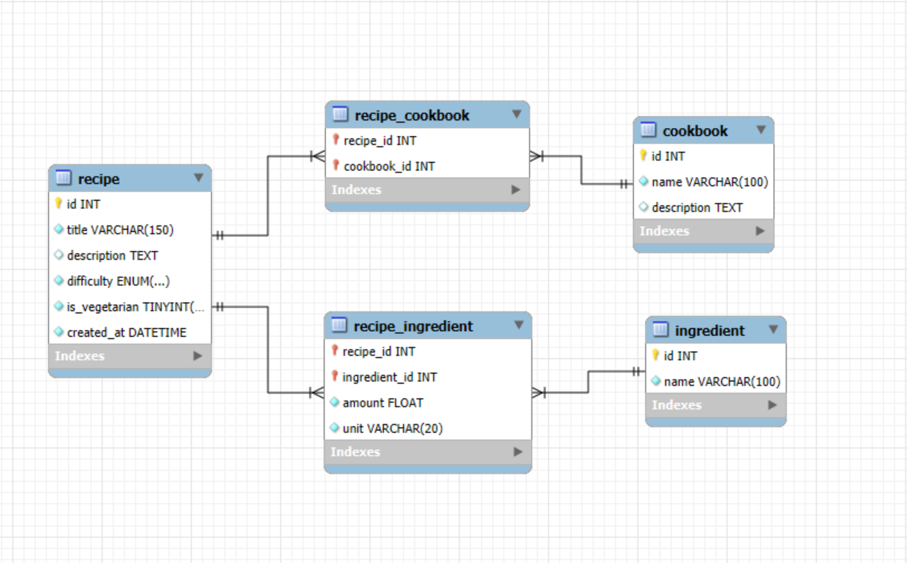
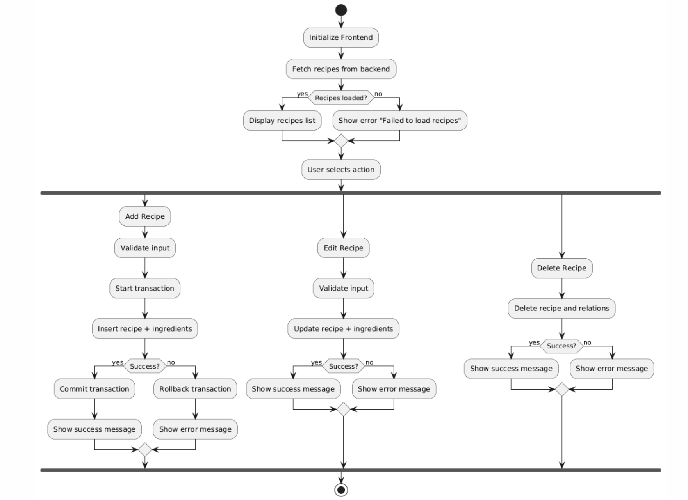
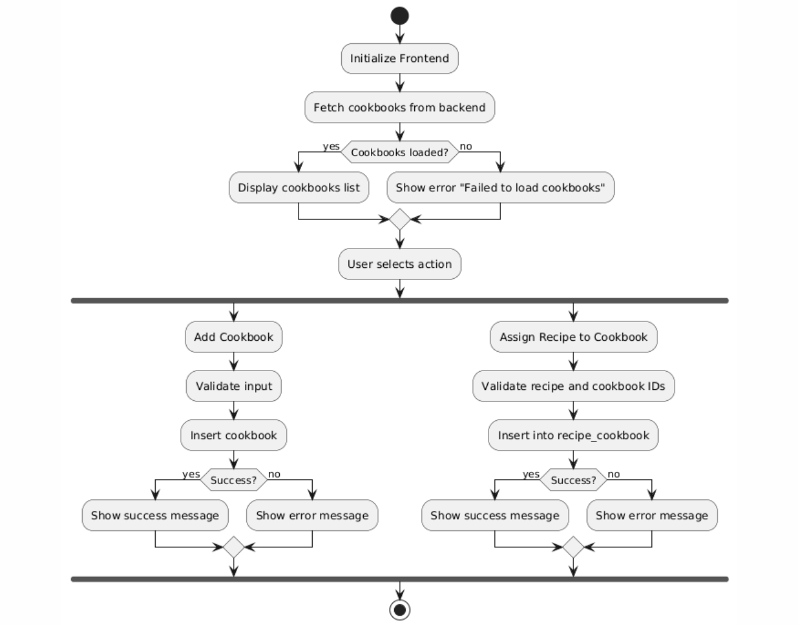

# Cookbooks page
## Project Overview
This is a school project. The purpose of this application is to create a web app using a relational database (MySQL) to manage recipes and cookbooks. The app allows users to:
- Manage recipes and cookbooks
- Assign recipes to cookbooks
- Import recipes and cookbooks from JSON files
### Author:
Sofia Hennelová, sofia.hennelova@gmail.com
### School: 
Secondary Technical School of Electrical Engineering Jecna 30, Prague
### Date: 
7\. 1\. 2026

## Requirements
### Backend (Python)
- flask 
- flask-cors
- mysql-connector-python 

### Frontend (React/Node.js)
- react 
- react-dom
- npm

### Database
- MySQL server

## Installation and configuration

### Database

1. Create a `recipe_project` schema in MySQL. For example, in MySQL Workbench:
```sql
CREATE DATABASE recipe_project;
```
2. Make sure your MySQL server is running and accessible.

### Backend

1. Navigate to the backend folder
2. Open in terminal
3. Create and activate a virtual environment:
```powershell
py -m venv .venv
.venv\Scripts\activate
```
4. Upgrade pip and install dependencies:
```powershell
py -m pip install --upgrade pip
py -m pip install flask flask-cors mysql-connector-python
```
5. Set up `config.json`
```
{
  "mysql": {
    "host": "127.0.0.1",
    "user": "username",
    "password": "password",
    "database": "recipe_project"
  }
}
```
6. Run the backend server:
```powershell
py main.py
```

### Frontend

1. Navigate to the frontend folder
2. Install Node.js dependencies:
```powershell
npm install
```
3. Run the frontend dev server:
```powershell
npm run dev
```
> **Note:** On school computers the version may be outdated.
> You can change it to a compatible version in `package.json`   
> Example:   
> ```json
> "devDependencies": {
>   "vite": "^4.5.0"
> }
> ```
> After changing the version, delete the old dependencies and reinstall:
> ```powershell
> rm -rf node_modules package-lock.json
> npm install
> ```

## Importing Data
Recipes and cookbooks can be imported from JSON files via the web UI.
### Recipe JSON format
- Title and ingredients are required
```json
    {
      "recipes": [
        {
          "title": "Title", 
          "description": "Description",
          "difficulty": "easy|medium|hard",
          "is_vegetarian": false,
          "ingredients": [
            {"name": "Name", "amount": 200, "unit": "g"},
            {"name": "Name", "amount": 300, "unit": "g"}
          ]
        }
      ]
    }
```
### Cookbook JSON format
- Name is required
```json
    {
      "cookbooks": [
        {"name": "Name", "description": "Description"},
        {"name": "Name", "description": "Description"}
      ]
    }
```


## Requirement analysis
The goal of the application is to provide a web-based system for managing recipes and cookbooks using a relational MySQL database.
### Functional Requirements
- **FR1:** The user can create a new recipe including its ingredients.
- **FR2:** The user can view a list of all recipes.
- **FR3:** The user can edit an existing recipe, including its ingredients.
- **FR4:** The user can delete a recipe.
- **FR5:** The user can create a new cookbook.
- **FR6:** The user can view a list of all cookbooks.
- **FR7:** The user can add a recipe to a cookbook.
- **FR8:** The user can view the details of a cookbook, including all assigned recipes.
- **FR9:** The system stores recipes and ingredients across multiple database tables.
- **FR10:** Creating or updating a recipe with its ingredients is performed within a single database transaction.
- **FR11:** The user can import recipes from a JSON file.
- **FR12:** The user can import cookbooks from a JSON file.
- **FR13:** The system validates input data during import (e.g. required fields, invalid values).
- **FR14:** The system allows generation of a summary report with aggregated data.

### Non-functional requirements
- **NFR1:** The application uses a real relational database management system (MySQL).
- **NFR2:** The database consists of at least five tables, including relational and junction tables.
- **NFR3:** The database contains at least two database views.
- **NFR4:** The system implements a many-to-many relationship between recipes and cookbooks.
- **NFR5:** The database model includes various data types (string, float, boolean, enum, datetime).
- **NFR6:** The system maintains database consistency using transaction rollbacks in case of errors.
- **NFR7:** If the database connection fails, the system displays a clear and understandable error message.
- **NFR8:** Configuration errors (e.g. invalid database credentials) are reported clearly to the user.
- **NFR9:** The application provides meaningful error messages for invalid user input.
- **NFR10:** The backend and frontend are separated using a REST API architecture.
- **NFR11:** The application can be started according to the provided documentation without requiring an IDE.

## Design
### Architecture
The application follows a **layered architecture**:
- **Database Layer**: MySQL with tables: `recipe`, `ingredient`, `recipe_ingredient`, `cookbook`, `recipe_cookbook`  
  - Views: `view_recipe_details`, `view_cookbook_summary`  
- **Repository Layer**: Handles direct SQL queries  
- **Service Layer**: Business logic, transactions, validations  
- **API Layer**: Flask REST API endpoints  
- **Frontend**: React application to interact with the API  

### Database Schema


### Behavioral diagram
#### Recipe Management

#### Cookbook Management


## REST API Overview

The backend provides a RESTful API implemented using Flask.  
All endpoints communicate using JSON over HTTP.

### Recipes
- **GET /recipes** - Returns all recipes
- **POST /recipes** - Creates a new recipe with ingredients
- **PUT /recipes/{recipe_id}** - Updates an existing recipe
- **DELETE /recipes/{recipe_id}** - Deletes a recipe
- **POST /import/recipes** - Imports recipes from a JSON file

### Cookbooks
- **GET /cookbooks** - Returns all cookbooks
- **POST /cookbooks** - Creates a new cookbook
- **POST /cookbooks/{cookbook_id}/recipes/{recipe_id}** - Adds a recipe to a cookbook
- **GET /cookbooks/{cookbook_id}/recipes** - Returns recipes assigned to a cookbook
- **POST /import/cookbooks** - Imports cookbooks from a JSON file
- **DELETE /cookbooks/{recipe_id}** - Deletes a cookbook

### Error Handling
Errors are returned as JSON with HTTP status codes (400, 404, 500).
```json
{
  "code": ,
  "description": "",
  "error": ""
}
```
#### Possible exceptions

Recipe
- 400, Title and ingredients are required
- 404, Recipe not found
- 400, Invalid import format

Cookbook
- 400, Name is required
- 400, Failed to add recipe to cookbook
- 400, Invalid import format
- 404, Cookbook not found

## License / legal note
This project is a school project and is not intended for commercial use. All source code was created by the author for educational purposes.

